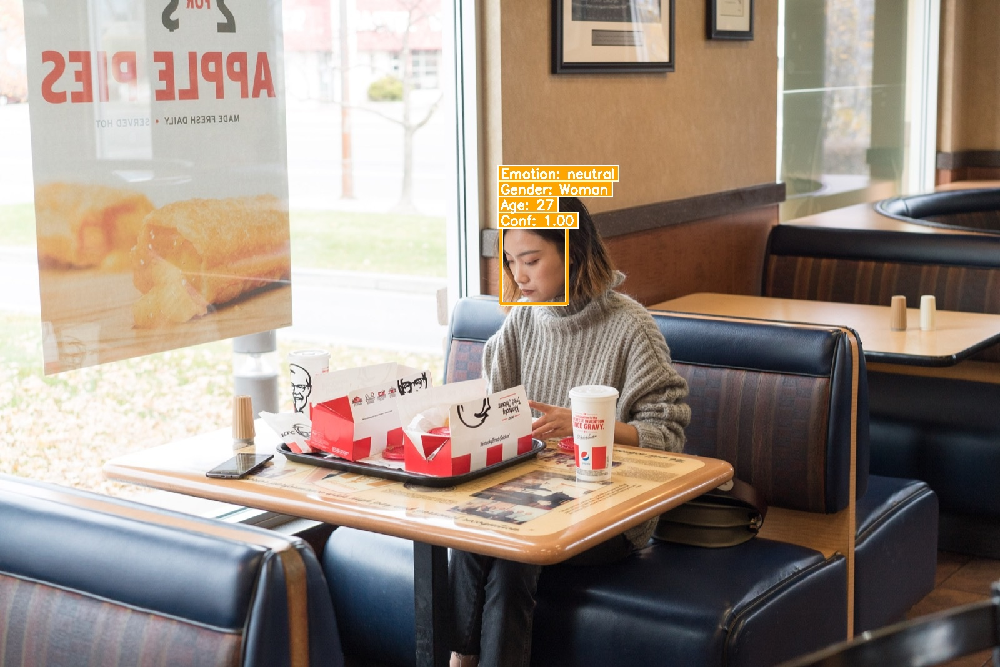

# deepface-api

[](https://github.com/lloydzhou/deepface-api/actions/workflows/ci.yml)
[](https://github.com/lloydzhou/deepface-api/actions/workflows/docker.yml)
[](https://www.python.org/)
[](https://fastapi.tiangolo.com/)
[](https://github.com/lloydzhou/deepface-api/pkgs/container/deepface-api)
[](LICENSE)
[](https://github.com/psf/black)
[](https://github.com/astral-sh/ruff)

A production-ready HTTP service that wraps [RetinaFace] (detection) and
[DeepFace] (age / gender / emotion / race attributes) behind a clean,
versioned [FastAPI] interface. Designed to be small, observable, and easy
to deploy anywhere — from a Raspberry Pi to a GPU box.



[RetinaFace]: https://github.com/serengil/retinaface
[DeepFace]: https://github.com/serengil/deepface
[FastAPI]: https://fastapi.tiangolo.com/

---

## Table of contents

- [Features](#features)
- [Quick start](#quick-start)
- [Configuration](#configuration)
- [API reference](#api-reference)
- [Client examples](#client-examples)
- [Architecture](#architecture)
- [Development](#development)
- [Deployment](#deployment)
- [Contributing](#contributing)
- [License](#license)

## Features

- 🎯 **Face detection** with RetinaFace (bounding box + confidence).
- 🧠 **Attribute analysis** — age, gender, dominant emotion, optional race.
- 🖼️ **Annotated output** — either a JSON response with a saved render, or
  a streamed JPEG with overlays.
- 🔌 **Versioned API** (`/api/v1/*`) with legacy unversioned aliases.
- 🐳 **Multi-arch Docker images** (linux/amd64 + linux/arm64) published to
  GitHub Container Registry on every release, plus an optional CUDA
  variant for GPU inference.
- 🩺 Built-in `/health` and `/ready` probes for orchestrators.
- 📦 PEP 621 packaging — install with `pip install deepface-api` once
  released, or as an editable dev install today.
- 🧪 Fast test suite that mocks heavy ML dependencies, plus pre-commit,
  ruff, black, mypy, hadolint, and CodeQL configured out of the box.

## Quick start

### Run with Docker (recommended)

```bash
docker compose up -d --build
```

The API will be available at <http://127.0.0.1:8008>.

### Pull a pre-built image

```bash
docker run -d --name deepface-api -p 8008:8008 \
  -v "$PWD/output:/data/output" \
  ghcr.io/lloydzhou/deepface-api:latest
```

GPU (requires the NVIDIA Container Toolkit on the host):

```bash
docker run -d --gpus all -p 8008:8008 \
  ghcr.io/lloydzhou/deepface-api:latest-gpu
```

### Run from source

```bash
python3.11 -m venv .venv && source .venv/bin/activate
pip install --upgrade pip
pip install -e ".[dev,test]"
cp .env.example .env
deepface-api               # console-script entry point
# or: python -m deepface_api
# or: uvicorn deepface_api.main:app --reload
```

## Configuration

All settings are read from environment variables (or a `.env` file in
the working directory). The canonical prefix is `DEEPFACE_`; legacy
unprefixed forms are still honored.

| Variable | Default | Description |
|---|---|---|
| `DEEPFACE_SERVER_HOST` | `0.0.0.0` | Bind host. |
| `DEEPFACE_SERVER_PORT` | `8008` | Bind port. |
| `DEEPFACE_OUTPUT_DIR` | `./output` | Where annotated images are saved. |
| `DEEPFACE_MAX_UPLOAD_SIZE_MB` | `10` | Maximum upload size in megabytes. |
| `DEEPFACE_LOG_LEVEL` | `INFO` | Standard Python log level. |
| `DEEPFACE_LOG_JSON` | `false` | Emit logs as JSON lines (for log aggregators). |
| `DEEPFACE_CORS_ORIGINS` | `*` | Comma-separated CORS origins. |
| `DEEPFACE_CORS_ALLOW_CREDENTIALS` | `false` | CORS credentials flag. |
| `DEEPFACE_ENABLE_DOCS` | `true` | Toggle `/docs`, `/redoc`, and `/openapi.json`. |

See [`.env.example`](.env.example) for a starter template.

## API reference

Interactive docs are served by the app itself:

- Swagger UI: <http://127.0.0.1:8008/docs>
- ReDoc: <http://127.0.0.1:8008/redoc>
- OpenAPI JSON: <http://127.0.0.1:8008/openapi.json>

### `GET /health` & `GET /api/v1/health`

Liveness probe — returns `{ "status": "ok", "version": "..." }`.

### `GET /api/v1/ready`

Cheap readiness probe (models warm up lazily on first analyze request).

### `POST /api/v1/analyze`

Detect faces and (optionally) analyze attributes.

| Param | Type | Default | Description |
|---|---|---|---|
| `file` | multipart file | required | The image to analyze. |
| `save_render` | bool | `false` | Save an annotated copy to `OUTPUT_DIR`. |
| `include_race` | bool | `true` | Include race fields in the response. |

```bash
curl --location 'http://127.0.0.1:8008/api/v1/analyze?save_render=true' \
  --form 'file=@./examples/image1.jpg'
```

### `GET /api/version`

Returns build / contract metadata for the running instance. Useful from
ops dashboards and bug reports.

```bash
curl http://127.0.0.1:8008/api/version
# {
#   "package_version": "2.0.0",
#   "api_version": "1",
#   "api_versions": ["1"],
#   "build_sha": "abc1234",
#   "build_time": "2026-05-26T12:00:00Z"
# }
```

Every API response also carries `X-API-Version: 1` and
`X-Request-ID: <hex>` headers — see [`docs/VERSIONING.md`](docs/VERSIONING.md)
for the full versioning policy.

### `POST /api/v1/detect_and_return`

Returns an annotated JPEG directly (`Content-Type: image/jpeg`).
Headers `X-Faces-Detected` and `X-Detection-Status` are populated.

```bash
curl --location 'http://127.0.0.1:8008/api/v1/detect_and_return?info_display=true' \
  --form 'file=@./examples/image1.jpg' \
  --output detected.jpg
```

> Legacy unversioned paths (`/analyze`, `/detect_and_return`, `/health`)
> remain available for backwards compatibility but are no longer
> documented in OpenAPI. New integrations should use `/api/v1/*`.

### Error format

All error responses are JSON with a consistent shape:

```json
{
  "status": "error",
  "code": "invalid_upload",
  "message": "Only image uploads are supported (content-type image/*)",
  "request_id": "9c1b3f9aab7d4d8aa6c0a9f1c8e9a4be"
}
```

## Client examples

### Python

```python
import httpx

with open("examples/image1.jpg", "rb") as fh:
    response = httpx.post(
        "http://127.0.0.1:8008/api/v1/analyze",
        files={"file": fh},
        params={"include_race": "false"},
        timeout=30,
    )
response.raise_for_status()
print(response.json())
```

### JavaScript / fetch

```javascript
const form = new FormData();
form.append("file", fileInput.files[0]);

const res = await fetch("http://127.0.0.1:8008/api/v1/analyze?save_render=true", {
  method: "POST",
  body: form,
});
const data = await res.json();
console.log(data);
```

## Architecture

```text
┌───────────────────────────────┐
│ FastAPI app (deepface_api)    │
│                               │
│  ├─ middleware/               │  Request-ID, CORS, exception handlers
│  ├─ api/v1/                   │  Versioned router (health + analyze)
│  ├─ schemas/                  │  Pydantic v2 response models
│  └─ services/                 │
│       uploads.py              │  validation + cv2 decode
│       vision.py               │  RetinaFace + DeepFace (threadpool)
└───────────────────────────────┘
            │
            ▼
   uvicorn (ASGI)  →  Docker / Compose / Kubernetes
```

See [`docs/ARCHITECTURE.md`](docs/ARCHITECTURE.md) for a detailed walkthrough.

## Development

```bash
python3.11 -m venv .venv && source .venv/bin/activate
pip install --upgrade pip
pip install -e ".[dev,test]"
pre-commit install

# Lint, format, type-check
ruff check src tests
black --check src tests
mypy src/deepface_api

# Run the unit suite (mocks heavy ML deps — completes in <1s)
pytest

# Integration test against a running container
docker compose up -d --build
curl -F file=@examples/image1.jpg http://127.0.0.1:8008/api/v1/analyze
```

See [`CONTRIBUTING.md`](CONTRIBUTING.md) for the full contributor guide.

## Deployment

- 🐳 Container image: `ghcr.io/lloydzhou/deepface-api`
- ☸️  Kubernetes / Compose examples: [`docs/DEPLOYMENT.md`](docs/DEPLOYMENT.md)
- 🩺 Healthchecks: `GET /health` (liveness) and `GET /api/v1/ready` (readiness)
- 📈 Structured logs: set `DEEPFACE_LOG_JSON=true` to emit JSON lines.

## Contributing

Pull requests are welcome! Please read
[`CONTRIBUTING.md`](CONTRIBUTING.md) and our
[`CODE_OF_CONDUCT.md`](CODE_OF_CONDUCT.md) before opening one.

Security issues should be disclosed privately per
[`SECURITY.md`](SECURITY.md).

## License

Distributed under the [MIT License](LICENSE).
